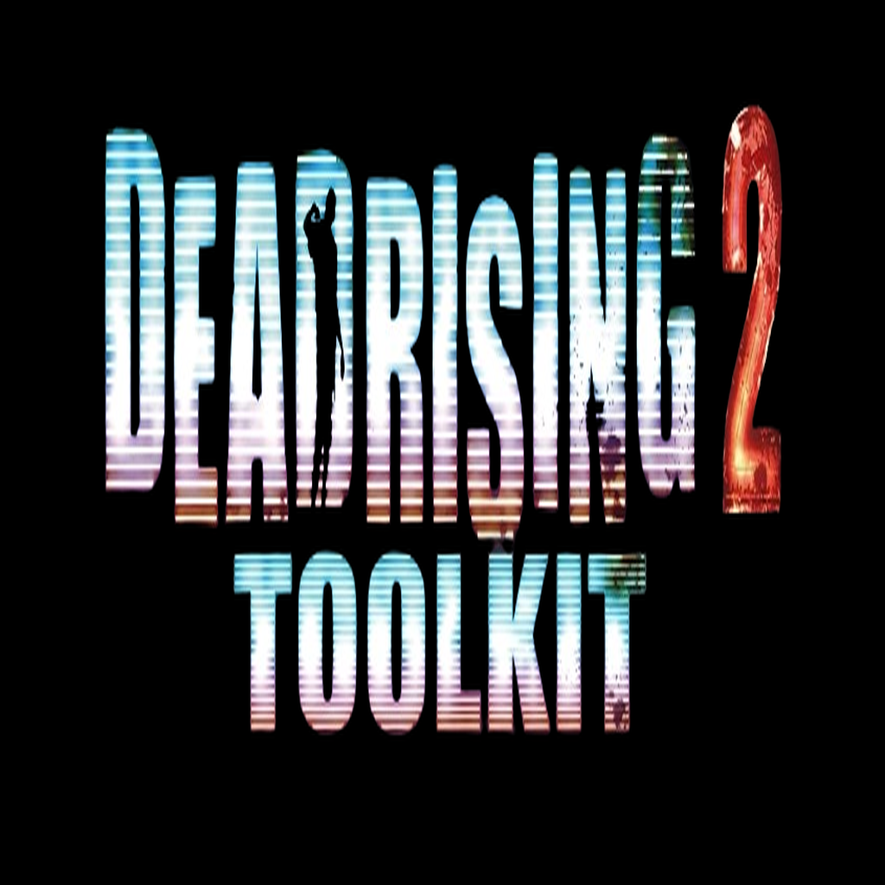

# DR2:OTR Toolkit

### Blender addon for importing and injecting character/prop meshes into Dead Rising 2 and Off the Record

---

A Blender addon that lets you pull character and prop meshes out of Dead Rising 2 and Off the Record, edit them, and inject them back in, without having to touch the game's file formats by hand.

It started as a personal modding tool and is shared here in case it helps anyone else working on these games. It's not a finished, bulletproof tool, so please read the warning section before spending hours on a mesh.

---

## Read This First

This addon is still a work in progress. A few things worth knowing before you dive in:

* Not every mesh will import or inject cleanly. The game uses several different internal mesh layouts depending on the type of object (characters, props, weapons, vehicles, and a few uncommon variants), and support across all of them isn't equally solid yet.
* There's a hard vertex limit per mesh, enforced by the addon since v4.0. Going over it will block the export rather than produce a broken file.
* Staying under that limit doesn't guarantee success. Some individual item slots have much smaller space reserved for them in the game itself, so a mesh that's technically within range can still cause problems if it's pushed far beyond the size of what it's replacing.
* Always keep the "Make Backup" option enabled when injecting. It's on by default for a reason.
* Bone weights, UVs, and tangents are recalculated from your Blender mesh on export. If something looks off in game, check Blender's console output after injecting, the addon prints warnings there.

If you're not comfortable risking a save file or reinstalling assets, don't test on your only save.

---

## Features

* Import character and prop meshes from the game's archive files into Blender
* Inject edited or replacement meshes back into those archives
* Support for multiple internal mesh types, including characters, props, weapons, and vehicles
* Automatic backup of the target file before writing
* A validation pass before injection that checks for common mesh problems
* Optional collision shape injection (best effort, clearly flagged when used)
* Optional material ID override on injection

---

## Installation

1. Download the addon `.zip` (don't unzip it)
2. In Blender, go to `Edit > Preferences > Add-ons > Install...`
3. Select the `.zip` and enable it in the addon list
4. A new panel will appear in the `View3D` sidebar under the DR2:OTR tab

Requires Blender 3.2 or newer.

---

## Basic Usage

1. **Import** a mesh from the archive using the DR2:OTR panel
2. **Edit** it in Blender however your workflow needs
3. Optionally run **Fix Mesh** before exporting to clean up common issues
4. Select your edited object and use **Inject into BIG**, pointing it at the target file, and keep backups enabled
5. Check Blender's console after injecting. Warnings are printed there even when the operator reports success

---

## Known Issues

* Standard character meshes are the most reliable path right now. More complex mesh types (weapons, some props, vehicles) work but are less thoroughly tested, and injection will warn you if it hits something unfamiliar.
* The addon can't guarantee a mesh will fit a specific item slot's memory, only that it's within the game's overall format limits. Large increases in vertex count compared to the original are flagged, but that's a heuristic, not a guarantee.
* Collision injection is best effort. Reshaped or new collision shapes use an approximate fallback and are flagged when used, existing untouched collision is left alone.
* The stored bounding box isn't recalculated after injection, so meshes that differ a lot in size from the original may render or cull incorrectly.
* Only the highest detail LOD level is currently updated on meshes that have more than one.

If you run into something not covered here, please open an issue with details on the object involved, before and after vertex/triangle counts, and the console output from injection.

---

## Changelog

### v1.15.0
* The vertex limit is now enforced at export time instead of just being logged, so an oversized mesh is blocked before anything is written.
* Added a warning for large vertex count increases relative to the original mesh, to help catch a common cause of in game crashes early.
* Minor cleanup to validation reporting.

### v1.14.0
* Last release before the export safety improvements above.
* Detection and injection support across multiple mesh types (characters, props, weapons, vehicles, and more)
* Non blocking mesh validation pass with console output
* Optional best effort collision injection
* Automatic backups on injection

If you're working with a pipeline built around older versions where exports were never blocked, note that this version will refuse to write a mesh that exceeds the hard limit rather than silently producing a broken file.

---

## Contributing

This is an ongoing, community driven project and still very much a work in progress. Contributions are welcome, especially around collision handling and the less tested mesh types.

If you run into a mesh that won't inject properly, a bug report with the object type and the console output is usually enough to track down the issue.

## Disclaimer

This tool is for modding your own local game files. It is not affiliated with or endorsed by Capcom. Back up your files and use at your own risk.

 

---

 

# Dead Rising 2 / Off the Record Toolkit

A desktop app for working with Dead Rising 2 and Dead Rising 2: Off the Record game files. Browse archives, preview textures, and get your files out in a format you can actually work with, all from one window. Now packaged as a standalone Windows executable, no Python or extra setup required.

This started as a personal project to make modding these games less painful, and it's grown into something a lot more complete. Still actively developed.

---

## What it does

* **Browse archives**, open them up and see everything inside in a clean tree view instead of raw hex
* **Unpack files** to a real folder on disk, ready to edit
* **Repack folders** back into a proper archive the game will load
* **Handle nested containers** automatically, so you're not manually chasing down every layer yourself
* **Preview textures** right in the app, no need to alt tab into another program to check your work
* **Batch operations**, unpack or repack multiple archives at once instead of doing them one by one
* **Drag and drop** a file straight onto the window to open it
* **Dark UI** that's easy on the eyes for long modding sessions

## Getting started

1. Grab the latest `.exe` from the Releases page
2. Run it, no install and nothing else to set up
3. Drag in a file, or use the file picker
4. Unpack, edit, repack. That's the whole loop

## Notes

* Archives repacked with this tool match the structure the game expects, so anything unpacked here can be repacked here without extra prep
* Works with both Dead Rising 2 and Dead Rising 2: Off the Record
* This is a hobby project built in spare time, so expect the occasional rough edge. Bug reports and feedback are always welcome

## Credits

Big thanks to the people who supported and inspired this project along the way:

* **Dodylectable**
* **UndeadFrankie**
* **𝗦𝗧𝗶𝗣𝟬**
* **Melina**
* **Gibbed**

This tool wouldn't be what it is without their support, feedback, and inspiration. Appreciate you all.

---

*Made for the DR2 modding community, by someone who's still zombie bashing years later.*
